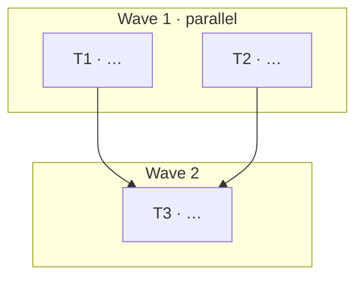

# Design: [FEATURE NAME]

**Feature**: `<name>` · **Spec**: ./spec.md

## Approach
[High-level solution and key decisions.]

## Affected Components
- Services: [admin / identity / notify / payment]
- Shared: [Application / Common / Communication / Web.Host]
- Frontend: [Angular areas]
- Modules: [BaseModule(s) to add/extend]

## Data & Contracts
- EF Core / MongoDB changes: …
- Migrations: …
- gRPC / HTTP proxy / nswag contract changes: …

## Auth & Tenancy
[Impact on OpenIddict/JWT, multi-tenant isolation.]

## Risks & Trade-offs
- [risk → mitigation]

## Implementation Plan

Small, independently committable tasks for Phase ③. Tasks in the same **wave** are independent and run in parallel (one agent each); a task runs only after every task it depends on is done. Tasks in the same wave **must touch disjoint files** — if two tasks share a file, add a dependency so they run in separate waves.

| #   | Task | Area / files touched | Depends on | Wave | Commit    |
|-----|------|----------------------|------------|------|-----------|
| T1  | …    | …                    | —          | 1    | `type: …` |
| T2  | …    | …                    | —          | 1    | `type: …` |
| T3  | …    | …                    | T1, T2     | 2    | `type: …` |

### Dependency & parallelization graph

> Edges point from a prerequisite to the task that depends on it. One subgraph per wave; tasks inside a wave run concurrently.

