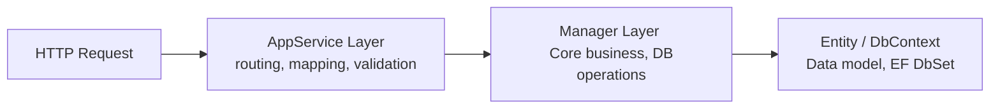
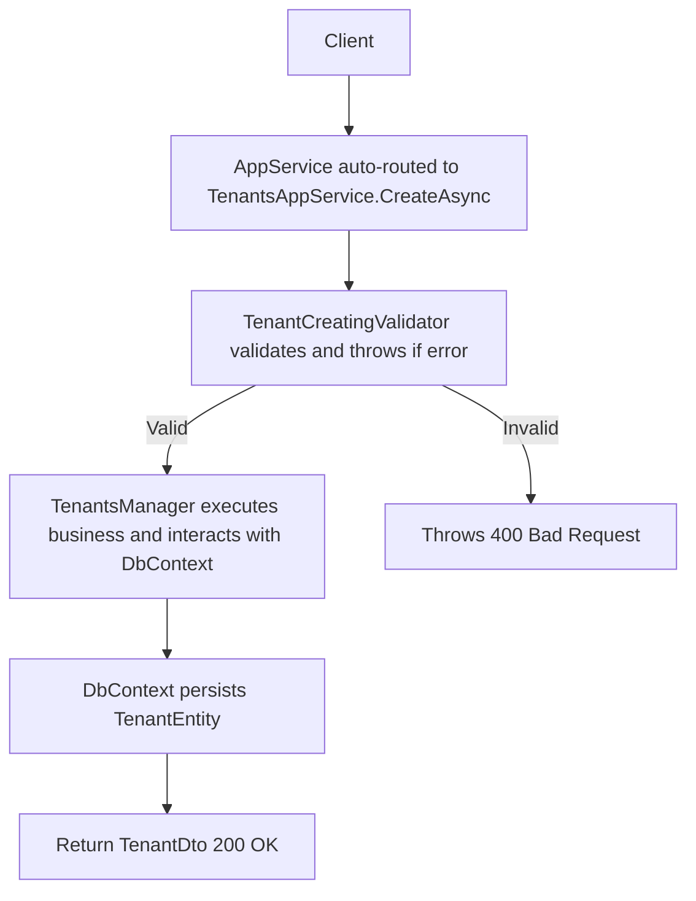

# App Service Design

This document describes the layered architecture pattern used for implementing RESTful API endpoints across all microservices in this boilerplate. The **Tenancy Management API** (`/api/tenants`) is used as the primary reference example throughout.

---

## Overview

Each business domain follows a consistent vertical slice structure composed of four key layers:



---

## Layer Breakdown

### 1. Entity Layer

**Location:** `srcs/services/<service>/Application/<Domain>/Entities/`

The entity class represents a persistable domain object. It inherits from one of the shared base classes:

| Base Class | Features |
|---|---|
| `BaseEntity<TKey>` | Primary key only |
| `BaseAuditEntity<TKey>` | Key + `CreatedAt`, `CreatedBy`, `UpdatedAt`, `UpdatedBy`, `ConcurrencyStamp` |
| `FullAuditEntity<TKey>` | All of the above + soft-delete `IsDeleted` flag |

**Example:**

```csharp
public class TenantEntity : FullAuditEntity<int>
{
    public string Name { get; set; } = default!;
    public string Organization { get; set; } = default!;
}
```

The entity must be registered as a `DbSet<T>` on the service's `DbContext`:

```csharp
public DbSet<TenantEntity> AppTenants { get; set; }
```

> `BaseDbContext` automatically stamps `CreatedAt`/`UpdatedAt` on `SaveChanges` via `ChangeTracker`.

---

### 2. Manager Layer

**Location:** `srcs/services/<service>/Application/<Domain>/`

The Manager encapsulates all core business logic and direct EF Core operations. It extends the shared `BaseManager<TKey, TEntity, TDbContext>` generic base, which provides:

- `IQueryable<TEntity> Queryable` � for composable read queries.
- Abstract CRUD methods: `GetAsync`, `CreateAsync`, `UpdateAsync`, `DeleteAsync`.

**Example:**

```csharp
public class TenantsManager(IServiceProvider services)
    : BaseManager<int, TenantEntity, MicroserviceSrvAdminDbContext>(services)
{
    public override async Task<TenantEntity> GetAsync(int id) { ... }
    public override async Task<TenantEntity> CreateAsync(TenantEntity entity) { ... }
    public override async Task<TenantEntity> UpdateAsync(TenantEntity entity) { ... }
    public override async Task DeleteAsync(int id) { ... }
}
```

The Manager receives the raw entity and works directly with the `DbContext` (`_dbContext`) inherited from the base class. It throws `ExceptionNotFound` when a requested entity does not exist.

---

### 3. Contract Layer (Interface + DTOs)

**Location:** `srcs/services/<service>/Contracts/<Domain>/`

The contract layer defines the public surface of the feature � its interface and all associated Data Transfer Objects (DTOs). This layer has **no implementation** and can be referenced by the Gateway or other services.

#### Service Interface

The interface inherits from `IAppService<TKey, TDto, TCreateReq, TUpdateReq>`, which declares `GetAsync`, `CreateAsync`, `UpdateAsync`, and `DeleteAsync`. Domain-specific operations (e.g., `GetAllAsync`) are declared on top.

```csharp
public interface ITenantsAppService
    : IAppService<int, TenantDto, TenantCreateDto, TenantUpdateDto>
{
    Task<PaginatedResult<TenantListDto>> GetAllAsync(PaginatedRequest request);
}
```

#### DTO Conventions

| DTO Class | Base Class | Purpose |
|---|---|---|
| `TenantCreateDto` | *(none)* | Payload for `POST /api/tenants` |
| `TenantUpdateDto` | `BaseDto<TKey>` | Payload for `PUT /api/tenants/{id}` |
| `TenantDto` | `BaseAuditDto<TKey>` | Full response (includes audit fields) |
| `TenantListDto` | `BaseDto<TKey>` | Lightweight item in paginated list |

---

### 4. AppService Layer

**Location:** `srcs/services/<service>/Application/<Domain>/`

The `AppService` is the outermost application layer. It acts as the **entry point for the HTTP API** � the `AppServiceFeatureProvider` automatically discovers all classes implementing `IAppService` and exposes them as MVC controllers with conventional routes and HTTP verbs.

#### Routing Convention (automatic, via `AppServiceFeatureProvider`)

| Method name prefix | HTTP Verb | Route |
|---|---|---|
| `GetAll...` | `GET` | `api/tenants` |
| `Get...` | `GET` | `api/tenants/{id}` |
| `Create...` | `POST` | `api/tenants` |
| `Update...` | `PUT` | `api/tenants/{id}` |
| `Delete...` | `DELETE` | `api/tenants/{id}` |

> Route segments are derived from the class name by stripping the `AppService` suffix and converting to kebab-case (e.g., `TenantsAppService` ? `api/tenants`).

#### Responsibilities

- Resolve `Manager` and `Validator` instances via `IServiceProvider`.
- Invoke validators before any write operation using `ValidateAndThrow`.
- Map between DTOs and entities � no raw entity types are exposed outside this layer.
- Delegate all data access to the `Manager`.

**Example:**

```csharp
public class TenantsAppService(IServiceProvider services) : BaseAppService, ITenantsAppService
{
    private readonly TenantsManager _manager = services.GetRequiredService<TenantsManager>();
    private readonly TenantCreatingValidator _creatingValidator = services.GetRequiredService<TenantCreatingValidator>();
    private readonly TenantUpdatingValidator _updatingValidator = services.GetRequiredService<TenantUpdatingValidator>();

    public async Task<TenantDto> CreateAsync(TenantCreateDto request)
    {
        _creatingValidator.ValidateAndThrow(request);
        var entity = await _manager.CreateAsync(new() { ... });
        return new TenantDto() { ... };
    }
}
```

---

### 5. Validator Layer

**Location:** `srcs/services/<service>/Application/<Domain>/`

Validators are implemented using **FluentValidation** and extend `DbValidator<TContract, TDbContext>` when database-aware checks (e.g., uniqueness) are needed.

- **`TenantCreatingValidator`** � validates `TenantCreateDto`; checks that the `Name` is unique across existing records.
- **`TenantUpdatingValidator`** � validates `TenantUpdateDto`; checks `Name` uniqueness while excluding the current record's `Id`.

```csharp
internal class TenantCreatingValidator : DbValidator<TenantCreateDto, MicroserviceSrvAdminDbContext>
{
    public TenantCreatingValidator(MicroserviceSrvAdminDbContext dbContext) : base(dbContext)
    {
        RuleFor(x => x.Name)
            .NotEmpty()
            .MaximumLength(100)
            .Must(name => !_dbContext.AppTenants.Any(t => t.Name == name))
            .WithMessage(name => $"Tenant name '{name}' already exists.");
    }
}
```

Validators are internal to the service and must be registered in the service's DI module.

---

## Request Flow

The following sequence illustrates a `POST /api/tenants` request:



---

## File Structure Reference


**Example file locations for the Tenancy feature:**

- Application Layer:
    - `srcs/services/admin/Application/Tenancy/Entities/TenantEntity.cs` (EF Core entity)
    - `srcs/services/admin/Application/Tenancy/TenantsManager.cs` (Business logic + persistence)
    - `srcs/services/admin/Application/Tenancy/TenantsAppService.cs` (HTTP entry point + DTO mapping)
    - `srcs/services/admin/Application/Tenancy/TenantsValidators.cs` (FluentValidation rules)
- Contract Layer:
    - `srcs/services/admin/Contracts/Tenancy/ITenantsAppService.cs` (Public service interface)
    - `srcs/services/admin/Contracts/Tenancy/Dto/TenantCreateDto.cs`
    - `srcs/services/admin/Contracts/Tenancy/Dto/TenantUpdateDto.cs`
    - `srcs/services/admin/Contracts/Tenancy/Dto/TenantDto.cs`
    - `srcs/services/admin/Contracts/Tenancy/Dto/TenantListDto.cs`

---

## Summary

| Layer | Responsibility | Key Base Type |
|---|---|---|
| **Entity** | Data model, DB persistence | `FullAuditEntity<TKey>` |
| **Manager** | Business logic, EF Core operations | `BaseManager<TKey, TEntity, TDbContext>` |
| **Contract** | Public interface + DTOs | `IAppService<TKey, ...>` |
| **AppService** | DTO mapping, validation orchestration, auto-routing | `BaseAppService` |
| **Validator** | Input rules, DB-aware uniqueness | `DbValidator<TContract, TDbContext>` |
